# &nbsp;

# 一、介绍

根据不同的场景，apolloconfig部署的架构会有很多种，这里不讨论细节，仅从部署架构的宏观角度，来介绍各种部署的方案

## 1.1 flowchart

用flowchart来表达部署架构，这里先介绍一些基本的概念

### 1.1.1 依赖关系

依赖关系用

表示1依赖2，也就是2必须存在，1才可以正常工作，例如

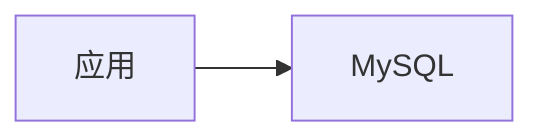

表示应用需要使用MySQL才可以正常工作

依赖关系可能会比较复杂，以及存在多层级的依赖，例如

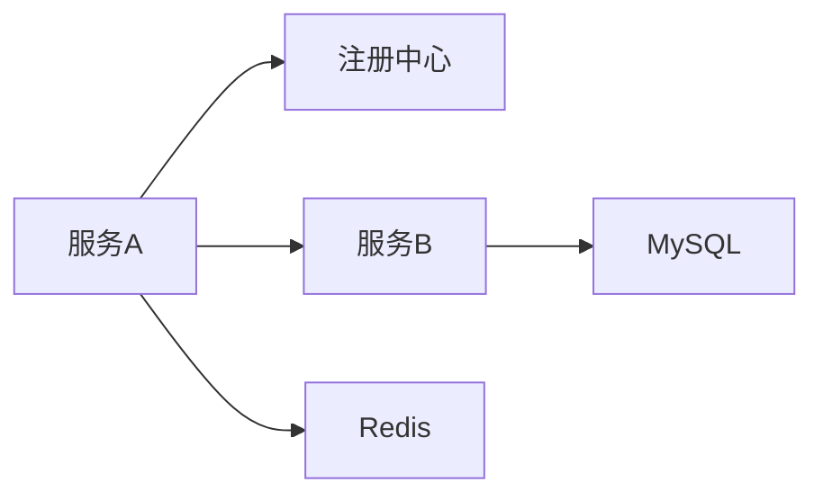

服务A需要注册中心，服务B，Redis

并且服务B需要MySQL

### 1.1.2 包含关系

包含关系用

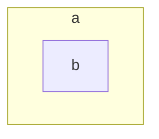

表示a包含b，也就是b是a的一部分，包含关系可能会出现嵌套的情况，例如

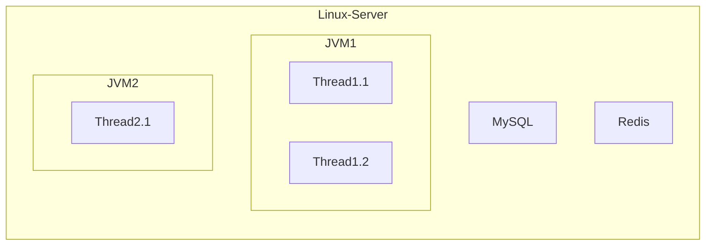

表示在一台Linux服务器上，运行着MySQL，Redis，2个JVM，JVM里分别又存在Thread

# 二、单机

单机部署的场景通常是新手学习，或者公司内部对性能要求不高的测试环境，不适用于生产环境

## 2.1 单机，单环境 All In One

这是最简单的架构，也是部署起来最方便的架构

需要：

* 1台Linux服务器：有JRE
* 2个database：1个PortalDB和ConfigDB

如下图，所有模块部署在同一台Linux机器上，总共有3个JVM进程

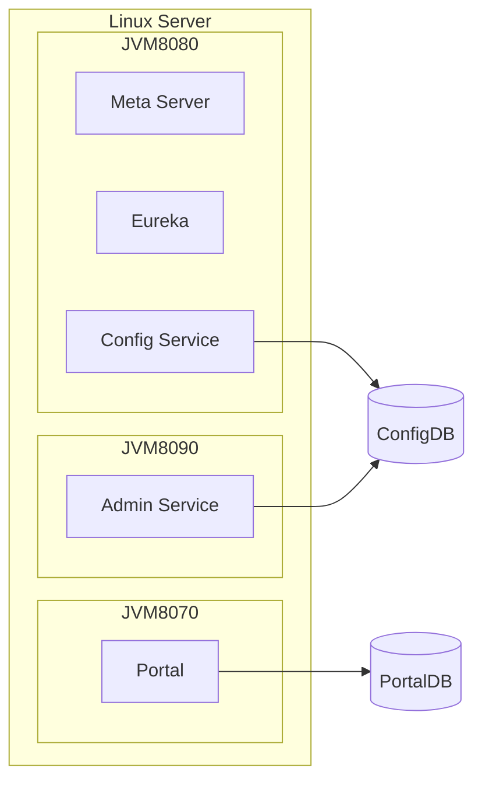

JVM8080：对外暴露的网络端口是8080，里面有Meta Server，Eureka，Config Service，其中Config Service又使用了ConfigDB

JVM8090：对外暴露的网络端口是8090，里面有Admin Service，并且Admin Service使用了ConfigDB

JVM8070：对外暴露的网络端口是8070，里面有Portal，并且Portal使用了PortalDB

如果加入模块之间的依赖，flowchart会变成

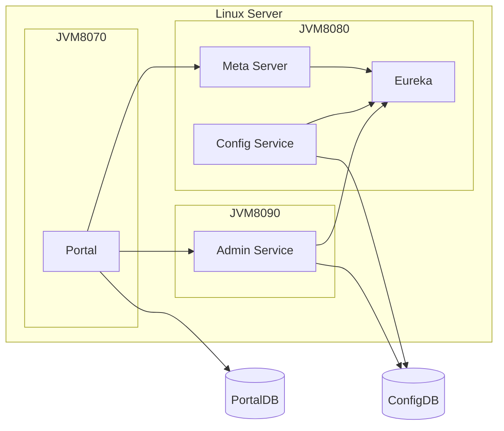

Config Service和Admin Service会把自己注册到Eureka上

Portal通过Meta Server服务发现Admin Service

为了flowchart看起来更加简洁，可以只表示进程之间的依赖关系

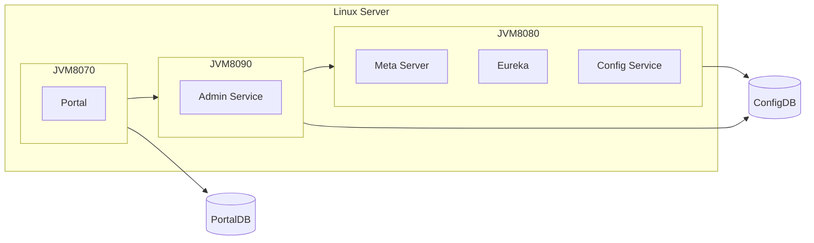

进程JVM8070依赖进程JVM8090和PortalDB

进程JVM8090依赖进程JVM8080和ConfigDB

进程JVM8080依赖ConfigDB

## 2.2 单机，单环境 分开部署

### 2.2.1 单机，单环境 分开部署 3台Linux服务器

3个JVM进程也可以分散到3台Linux机器上

需要：

* 3台Linux服务器：分别部署3个进程
* 2个database

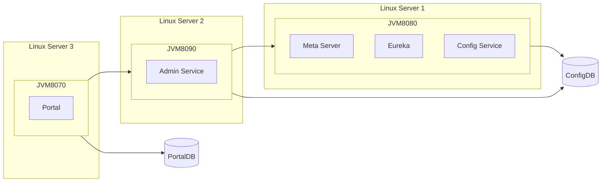

### 2.2.2 单机，单环境 分开部署 2台Linux服务器

不过通常我们会把Config Service和Admin Service部署在一台Linux服务器上

需要：

* 2台Linux服务器：1台部署Portal，另一台部署Config Service和Admin Service
* 2个database

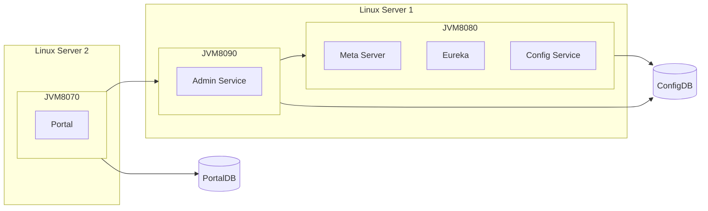

后续为了flowchart更简洁，将JVM8080里的内容进行简化，只显示Config Service，里面的Meta Server和Config Service不再显示

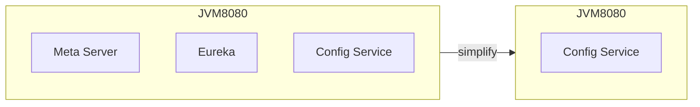

所以部署架构可以简化表示成

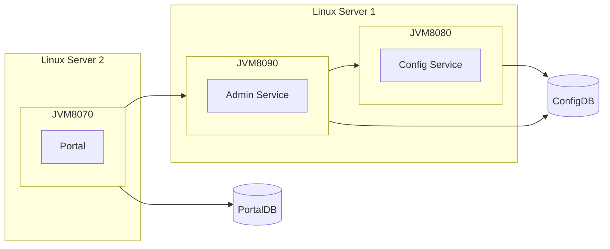

## 2.3 单机，双环境

单个环境基本没法满足实际的应用场景，例如公司里有SIT测试环境和UAT测试环境，此时需要部署2个环境提供配置服务

很容易想到的部署架构如下，把单机，单环境的部署架构重复2次即可

需要：

* 2台Linux服务器
* 4个database

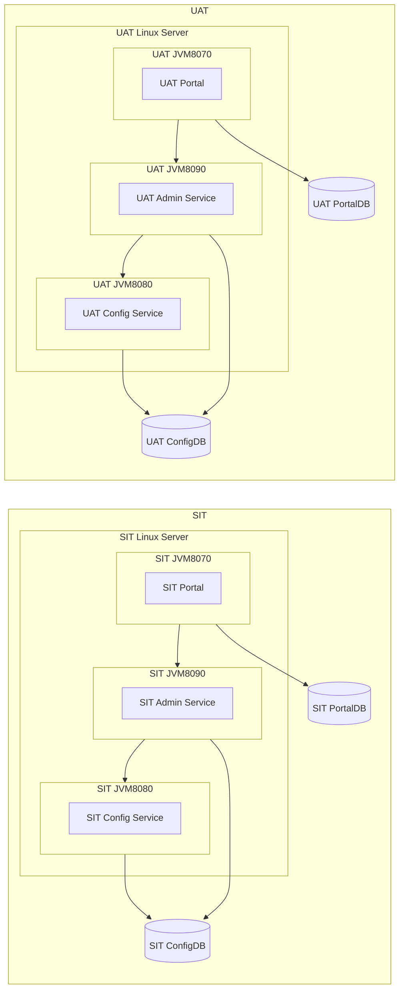

但是这种方案，会存在2个Portal界面，没法1个界面管理2个环境，使用体验不是很好，Portal实际上可以只部署1套，推荐的部署架构如下

* 3台Linux服务器：
  * Portal Linux Server单独部署Portal
  * SIT Linux Server部署SIT的Config Service和Admin Service
  * UAT Linux Server部署UAT的Config Service和Admin Service
* 3个database：1个PortalDB + 1个SIT的ConfigDB + 1个UAT的ConfigDB

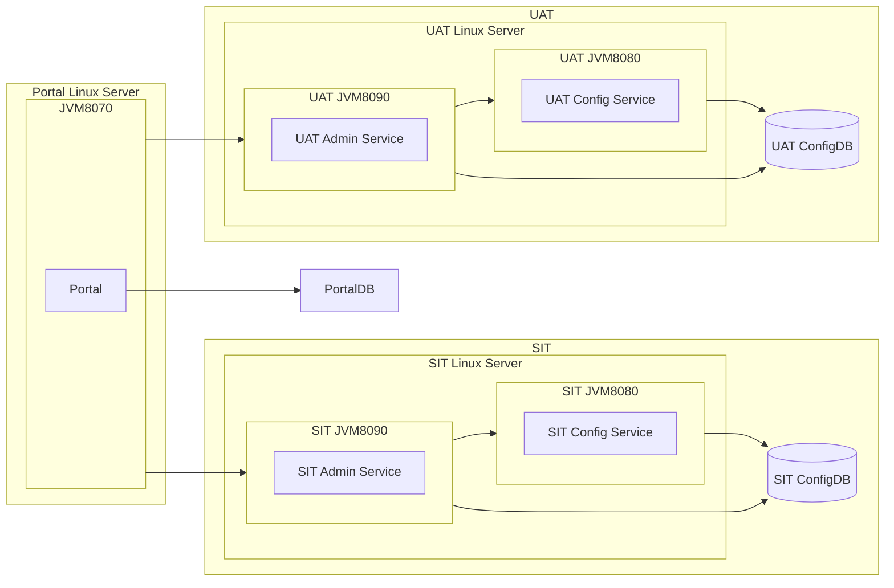

## 2.4 单机，三个环境

假设现在需要满足SIT、UAT、PP这3个环境的使用场景，

在之前双环境的基础之上，再多加1台PP环境的Linux服务和ConfigDB即可，Portal通过修改配置的方式，来管理这3个环境

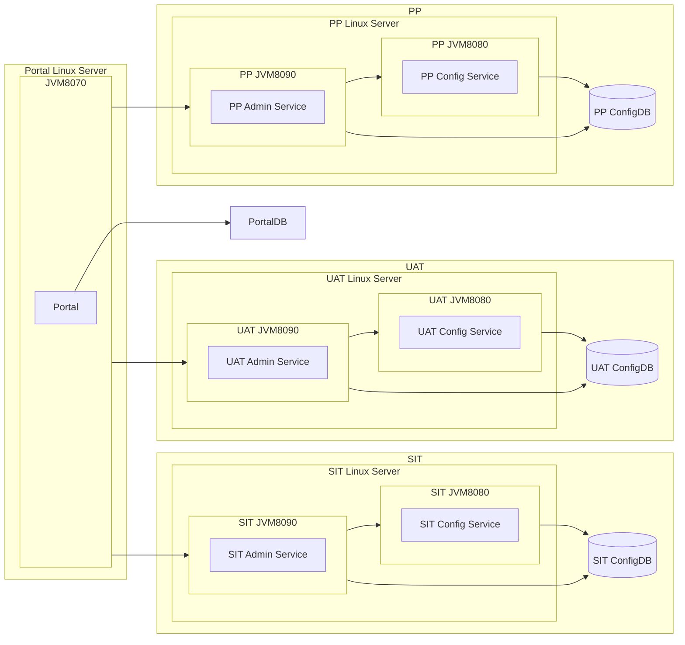

## 2.5 单机，多个环境

原理同上，每个环境1台Linux服务器+1个ConfigDB

然后Portal添加新环境的信息即可

# 三、高可用